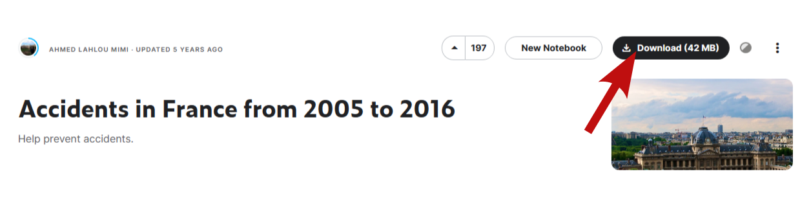

[](https://github.com)
[](https://www.python.org/)
[](https://github.com/Naereen/badges/)
[](https://github.com/Naereen/badges)

<br>
<H1 align="center"> 
	<b>French road accidents (2005-2016)</b>
	<br>
	
</H1>
<br>

Description & Content
-----------------------------------------------
This project is a simple Data Science analysis based on the `Kaggle` dataset : [Accidents in France from 2005 to 2016](https://www.kaggle.com/datasets/ahmedlahlou/accidents-in-france-from-2005-to-2016) provided by [Ahmed Lahlou Mimi](https://www.kaggle.com/ahmedlahlou).

The dataset contains several data tables related to recorded accidents in french territory:
- `caracteristics.csv`
- `holidays.csv`
- `places.csv`
- `users.csv`
- `vehicles.csv`

All tables are related by a primary key named `Num_Acc` which corresponds to a unique accident id.
The additional `data_collection.py` script performs a bunch of instructions to :
- Collect required data tables using the `Kaggle API`
- Merge all tables on their primary key
- Write a easy-to-read file for analysis (`data/french_accidents.parquet`)

The `plot_utils.py` script contains visualisation functions to help, minimize and clarify some notebook contents.


Installation
------------------------------------------------
To have a look and manipulate the main dataset, please consider the following steps:

1. **First, create a copy of the project:**

_Via https_
```shell
git clone https://github.com/pmatran/french_road_accidents.git
```
_Via ssh_
```shell
git clone git@github.com:pmatran/french_road_accidents.git
```

2. **Next, make sure to install all dependencies:**

```shell
pip install -r requirements.txt
```

3. **Finally, download and build the main dataset:**

_Via manual download_

Go the the [`Kaggle` page](https://www.kaggle.com/datasets/ahmedlahlou/accidents-in-france-from-2005-to-2016) of the dataset and dowload the `.zip` file.



Put the `archive.zip` file in the `data/` folder and use the following command:

```shell
python data_collection.py
```

_Via the Kaggle API_

If your are familiar with `Kaggle` and have your own  `API token`, just run:

```shell
python data_collection.py -api
```


Get started
-----------------------------------------------

**_Start the Exploraroty Data Analysis_**
```shell
jupyter notebook EDA.ipynb
```

**_Start the Machine Learning Analysis_**
```shell
jupyter notebook PCA_Clustering.ipynb
```


Report
-----------------------------------------------
A summary of insights extracted from the dataset is available [here](https://french-road-accidents-2005-2016.brizy.site/).


Contributing
------------------------------------------------
Bug reports, code contributions, or improvements to the documentation are welcome from the community. 
Feel free to suggest improvements by working with your own fork version of `french-road-accidents`. Go to the project page and hit the **Fork** button.
You will want to clone your fork to your machine:

```shell
git clone <url_french_road_accidents> <french_road_accidents-yourname>
cd french_road_accidents
```


Ressources
-----------------------------------------------
+ [Pandas documentation](https://pandas.pydata.org/docs/)
+ [Plotly documentation](https://plotly.com/python/)
+ [ADTK  documentation](https://adtk.readthedocs.io/en/stable/)
+ [Scikit-learn documentation](https://scikit-learn.org/stable/)


Disclaimer :no_entry:
-----------------------------------------------
This project was created to evaluate the analytic skills of the owner ([@pmatran](https://github.com/pmatran)) by his professor at M2-IASchool (Bordeaux, FRANCE).


Coffee beaks :coffee:
-----------------------------------------------
[](https://www.buymeacoffee.com/pmatran)
